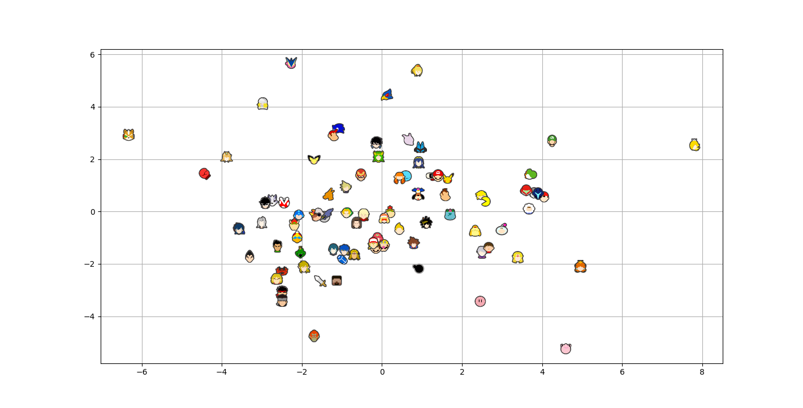

# Smash Attributes Analyser

TL;DR This plot is supposed to show how similarly characters handle based on their [Ultimate Frame Data](https://ultimateframedata.com/stats) stats. The closer two characters are, the closer they should "feel" while running, jumping, etc. This doesn't mean that they have similar playstyles or hitboxes or are equally "good", but they should at least feel somewhat similar.

I normally play Mii Brawler, and lately I've been playing a little Inkling post-patch and I couldn't help but notice they had some weird similarities and felt like they played somewhat similarly. I decided to do a little more of a serious analysis on how different stats (air speed, fall speed, running speed, etc.) compared among the cast.

The steps that I did to get to this point were:
- Scraped the necessary data from [Ultimate Frame Data](https://ultimateframedata.com/stats)
- Standardized the data (Making it so stats were compared between characters and no stats had higher priority despite higher raw values)
- Compressed the 15 or so dimensions down into 2 dimensions using [skit-learn](https://scikit-learn.org/stable/)'s [PCA](https://en.wikipedia.org/wiki/Principal_component_analysis) implementation
- Charted the results using [mathplotlib](https://matplotlib.org/)

Notes:
- The X & Y axes are completely arbitrary, they're just approximate representation of the 15 or so dimensions (or attributes) that each character has (compressed using [PCA](https://en.wikipedia.org/wiki/Principal_component_analysis))

- DLC characters will be the least reliable as they don't have all of the listed attributes. When missing an stat (fall speed, for example), I just substituted the median value of that attribute from all charcters. 

- I have no idea why Wii Fit is between the two Samuses, that's just a wierd oddity that I wanted to point out

- The list of attributes I took under consideration:
  - Air Acceleration
    - Base 
    - Additional
    - Max
  - Air Speed
  - Fall Speed
  - Gravity
  - Jump Height
    - Full Hop
    - Short Hop
    - Air Jump
  - Jump Durations
    - Short Hop
    - Full Hop
    - SH Fast Fall
    - FH Fast Fall
  - Walk Speed
  - Dash and Run Speed
    - Initial Dash
    - Run Speed
    - Dash Frames
    - Pivot Dash Frames